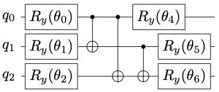
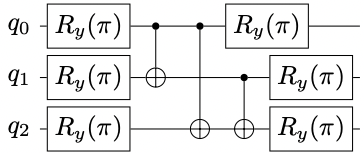
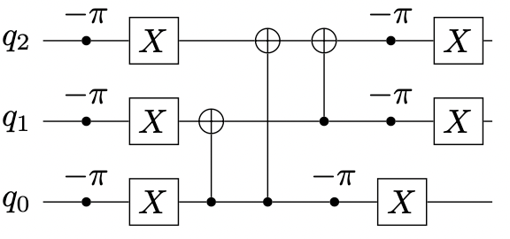
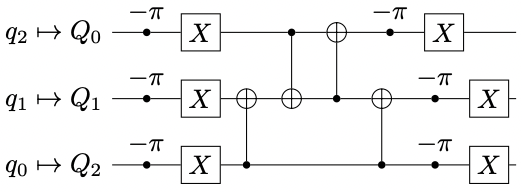

[](https://pypi.org/project/mqt.bench/)
[](https://opensource.org/licenses/MIT)
[](https://github.com/cda-tum/MQTBench/actions/workflows/deploy.yml)
[](https://github.com/cda-tum/MQTBench/actions/workflows/coverage.yml)
# MQT Bench: Benchmarking Software and Design Automation Tools for Quantum Computing

MQT Bench is a benchmarking suite with cross-layer support. This means, that the same benchmarking
algorithms are provided for different abstraction layers throught the quantum computing
software stack.

MQT Bench uses the structure proposed by the openQASM 3.0 consortia [1] and offers benchmarks
on four different abstraction layers:
1) Algorithm Layer
2) Target-independent Layer
3) Target-dependent Native Gates Layer
4) Target-dependent Mapped Layer

[//]: # (![alt text]&#40;img/layer_1.png "Title"&#41;)


Variational quantum algorithms (VQAs) are an emerging class of quantum algorithms with a 
wide range of applications. A respective circuit is depicted above and shows an example of an 
ansatz function frequently used for variational quantum eigensolvers, a subclass of VQAs. On 
this abstraction layer, the circuit is parameterized by the angles 
&theta;<sub>i</sub> of the six single-qubit gates. This is the Algorithm layer description.

[//]: # (![alt text]&#40;img/layer_2.png "Title"&#41;)


VQAs are hybrid quantum-classical algorithms, where the parameters of the quantum ansatz are 
iteratively updated by a classical optimizer analogous to conventional gradient-based optimization.
Assuming these parameters have been calculated, they are now propagated and the resulting 
quantum circuit is shown in above. This is the target-independent layer description.

[//]: # (![alt text]&#40;img/layer_3.png "Title"&#41; ![alt text]&#40;img/arch.png "Title"&#41;)



Different quantum computer realizations support different native gate-sets. 
In our example, the target device is the IBM-Q Manila device which natively supports 
R<sub>z</sub>, √X, CX, U, and X and is shown in the graph. Consequently, the R<sub>y</sub> 
gates in the previous figure have to be converted using only the native gates. 
In this case, they are substituted by a sequence of R<sub>z</sub>
gates denoted as phase gates of -pi and X gates as shown in the figure above.
This is the target-dependent native gates layer description.

[//]: # (![alt text]&#40;img/layer_4.png "Title"&#41;)


The architecture of the IBM-Q Manila device is shown in the hardware architecture figure and 
it defines between which qubits a two-qubit operation may be performed.
Since the circuit shown in the previous figure contains CX gates operating between all combination of 
qubits, there is no mapping directly matching the target architecture's layout. As a consequence, 
a non-trivial mapping followed by a round of optimization leads to the resulting circuit shown 
in the figure above. This is also the reason for the different sequence of CX gates compared 
to the previous example.
This is the target-dependent mapped layer description.

## Benchmark Selection
So far, the following benchmarks are implemented:
- Amplitude Estimation
- GHZ State
- Graph State
- W State
- Grover's Algorithm
- Shor's Algorithm
- QAOA
- VQE
- VQE-ansätze with random values:
  - Two Local
  - Real Amplitudes
  - Efficient SU2
- Deutsch Jozsa
- HHL
- Quantum Walk
- Quantum Fourier Transformation
- Quantum Fourier Transformation Entangled
- Quantum Phase Estimation Exact
- Quantum Phase Estimation Inexact

Additionally, several quantum application algorithms are available.

## Native Gate-Set Support
So far, MQT Bench supports the following native gate-sets:
1) IBM-Q gate set with ['id', 'rz', 'sx', 'x', 'cx', 'reset']
2) Rigetti gate set with ['id, 'rx', 'rz', 'cz', 'reset']

## Mapping Scheme Support
Currently, MQT Bench supports two mapping schemes:
1) Smallest Fitting Architecture Mapping: Maps quantum circuits to the smallest architecture with a sufficient number of physical qubits
2) Biggest Architecture Mapping: Always use the biggest available hardware architecture

# Structure
- src: Directory for  utils.py file and the source code of the benchmarks
- benchmarks: On top level, the benchmarks are included with one benchmark algorithms per file. 
  - Additionally, folders for each qiskit application module and their respective benchmarks are listed
- benchviewer: This is the folder for our webpage hosted at [https://www.cda.cit.tum.de/app/benchviewer/](https://www.cda.cit.tum.de/app/benchviewer/).
```
MQT Bench/
│ - README.md
│
└───mqt/bench/
│   │───benchmark_generator.py  
│   └───utils/
│   │   │ - utils.py
│   │
│   └───benchmarks/
│       │ - ae.py
│       │   ...
│       │ - wstate.py
│       └─── qiskit_application_finance
│       │       ...
│       └─── qiskit_application_ml
│       │       ...
│       └─── qiskit_application_nature
│       │       ...
│       └─── qiskit_application_optimization
│       │       ...
│
│───benchviewer/
└───qasm_output/
```

# Repository Usage
Preferably, our benchmarks are accessed using our website or our using `pip install mqt.bench`. 
Since all generated benchmarks hosted on our website are included in this repository, the repository is very large (>25 GB).
Therefore, please do a sparse-checkout if you want to directly access the repository itself:

```
git clone --filter=blob:none --no-checkout  https://github.com/cda-tum/MQTBench.git
cd MQTBench
git sparse-checkout init --cone
git sparse-checkout set mqt img
git checkout main
```

# Packages Usage
To start the creation of all benchmarks, just run the jupyter notebook ```python benchmark_creator.py <config_name>.json``` file.

# References:
[1] A.Cross et al., OpenQASM 3: A broader and deeper quantum assembly language, [arXiv:2104.14722](https://arxiv.org/abs/2104.14722), 2021 
