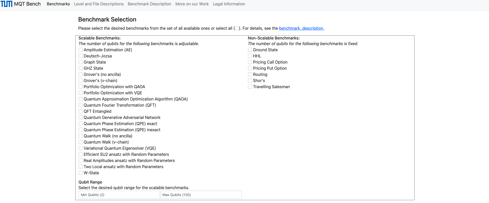
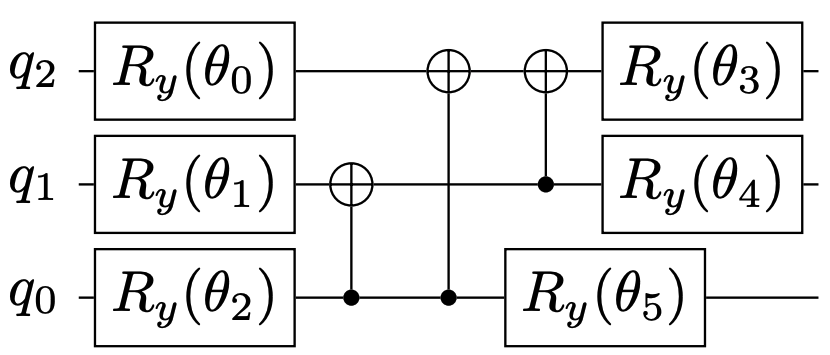

[](https://pypi.org/project/mqt.bench/)
[](https://opensource.org/licenses/MIT)
[](https://github.com/cda-tum/MQTBench/actions/workflows/coverage.yml)
[](https://github.com/cda-tum/MQTBench/actions/workflows/deploy.yml)
[](https://codecov.io/gh/cda-tum/MQTBench)
[](https://github.com/cda-tum/MQTBench/actions/workflows/server_deploy.yml)

# MQT Bench: Benchmarking Software and Design Automation Tools for Quantum Computing

MQT Bench is a quantum circuit benchmark suite with cross-level support, i.e., providing the same benchmark algorithms for different abstraction levels throughout the quantum computing
software stack.

MQT Bench is part of the Munich Quantum Toolkit (MQT) developed by the [Chair for Design Automation](https://www.cda.cit.tum.de/) at the [Technical University of Munich](https://www.tum.de/) and is hosted at [https://www.cda.cit.tum.de/mqtbench/](https://www.cda.cit.tum.de/mqtbench/).

[](https://www.cda.cit.tum.de/mqtbench)

This documentation explains how to use MQT Bench to create and filter benchmarks.

## Abstraction Levels

It uses the structure proposed by the openQASM 3.0 specification [[1]](https://arxiv.org/abs/2104.14722) and offers benchmarks
on four different abstraction levels:

1. Algorithmic Level
2. Target-independent Level
3. Target-dependent Native Gates Level
4. Target-dependent Mapped Level

An example is given in the following:

1. Algorithmic Level



Variational Quantum Algorithms (VQAs) are an emerging class of quantum algorithms with a wide range of
applications. A respective circuit is shown above, it represents an example of an ansatz function
frequently used for Variational Quantum Eigensolvers (VQEs), a subclass of VQAs. On this abstraction
level, the circuit is parameterized by the angles θ<sub>i</sub> of the six single-qubit gates.

2. Target-independent Level


VQAs are hybrid quantum-classical algorithms, where the parameters of the quantum ansatz are
iteratively updated by a classical optimizer analogous to conventional gradient-based optimization.
Consider again the circuit from the previous figure. Assuming these parameters have been determined,
e.g., θ<sub>i</sub> = −π for i = 0, ..., 5, they are now propagated and the resulting quantum circuit is
shown above.

3. Target-dependent Native Gates Level


Different quantum computer realizations support
different native gate-sets. In our example, we consider the
IBMQ Manila device as the target device which natively supports I, X, √X, Rz and CX gates.
Consequently, the Ry gates in the previous figure have to be converted using only these native gates. In this case,
they are substituted by a sequence of X and Rz gates (denoted as • with a phase of −π).

4. Target-dependent Mapped Level


The architecture of the IBMQ Manila device is shown
above on the right and it defines between which qubits a two-qubit operation may be performed.
Since the circuit shown in the previous figure contains CX gates operating between all combination of qubits,
there is no mapping directly matching the target architecture's layout. As a consequence,
a non-trivial mapping followed by a round of optimization leads to the resulting circuit
shown above on the left. This is also the reason for the different sequence of CX gates compared
to the previous example.

This circuit is now executable on the IBMQ Manila device, since all hardware induced requirements are fulfilled.

## Benchmark Selection

So far, the following benchmarks are implemented and provided:

- Amplitude Estimation
- Deutsch-Jozsa
- GHZ State
- Graph State
- Ground State
- Grover's (no ancilla)
- Grover's (v-chain)
- HHL
- Portfolio Optimization with QAOA
- Portfolio Optimization with VQE
- Pricing Call Option
- Pricing Put Option
- Quantum Fourier Transformation (QFT)
- QFT Entangled
- Quantum Generative Adversarial Network (QGAN)
- Quantum Phase Estimation (QPE) Exact
- Quantum Phase Estimation (QPE) Inexact
- Quantum Walk (no ancilla)
- Quantum Walk (-chain)
- Routing
- Shor's
- Travelling Salesman
- Variational Quantum Eigensolver (VQE)
- VQE-ansätze with random values:
  - Efficient SU2 ansatz with Random Parameters
  - Real Amplitudes ansatz with Random Parameters
  - Two Local ansatz with Random Parameters
- W-State

See the [benchmark description](https://www.cda.cit.tum.de/mqtbench/benchmark_description) for further details on the individual benchmarks.

## Quantum Circuit Compiler Support

At the moment, two compilers are supported:

1. [Qiskit](https://qiskit.org/documentation/) with the compiler settings: Optimization level 0 to 3
2. [TKET](https://cqcl.github.io/tket/pytket/api/) with the compiler settings: Line placement and graph placement

## Native Gate-Set Support

So far, MQT Bench supports the following native gate-sets:

1. IBMQ gate-set: _\['rz', 'sx', 'x', 'cx', 'measure'\]_
2. Rigetti gate-set: _\['rx', 'rz', 'cz', 'measure'\]_
3. IonQ gate-set: _\['rxx', 'rz', 'ry', 'rx', 'measure'\]_
4. OQC gate-set: _\['rz', 'sx', 'x', 'ecr', 'measure'\]_

## Device Support

So far, MQT Bench supports the following devices:

1. IBMQ Washington with 127 qubits
2. IBMQ Montreal with 27 qubits
3. Rigetti Aspen-M1 with 80 qubits
4. IonQ with 11 qubits
5. OQC Lucy with 8 qubits

# Repository Structure

- mqt/bench/utils: Directory for the utils.py file
- mqt/bench/tests: Directory for the tests for MQT Bench
- mqt/bench/benchmarks: On the top-level, each benchmark algorithm is included as a separate file.
  - Additionally, folders for each IBM Qiskit application module and their respective benchmarks are listed.
- mqt/benchviewer: This is the folder for the webpage
  (which can be started locally and is also hosted at
  [https://www.cda.cit.tum.de/mqtbench/](https://www.cda.cit.tum.de/mqtbench/)).

```
MQTBench/
│ - README.md
│
└───mqt/bench/
│   │───benchmark_generator.py
│   └───utils/
│   │   │ - utils.py
│   │
│   └───tests/
│   └───benchmarks/
│       │ - ae.py
│       │   ...
│       │ - wstate.py
│       └─── qiskit_application_finance
│       │       ...
│       └─── qiskit_application_ml
│       │       ...
│       └─── qiskit_application_nature
│       │       ...
│       └─── qiskit_application_optimization
│       │       ...
│
│───────benchviewer/
        │ - main.py
        │   ...
```

# Repository Usage

There are three ways how to use this benchmark suite:

1. Via the webpage hosted at [https://www.cda.cit.tum.de/mqtbench/](https://www.cda.cit.tum.de/mqtbench/)
2. Via the pip package `mqt.bench`
3. Directly via this repository

Since the first way is rather self-explanatory, the other two ways are explained in more detail in the following.

## Usage via pip package

MQT Bench is available via [PyPI](https://pypi.org/project/mqt.bench/)

```console
(venv) $ pip install mqt.bench
```

To generate a benchmark circuit on the algorithmic level, please use the `get_one_benchmark` method:

```python3
def get_one_benchmark(
    benchmark_name: str,
    level: Union[str, int],
    circuit_size: int = None,
    benchmark_instance_name: str = None,
    compiler: str = "qiskit",
    compiler_settings: dict[str, dict[str, any]] = None,
    gate_set_name: str = "ibm",
    device_name: str = "ibm_washington",
):
```

The available parameters are:

- `benchmark_name`: `"ae"`, `"dj"`, `"grover-noancilla"`, `"grover-v-chain"`, `"ghz"`, `"graphstate"`, `"portfolioqaoa"`,
  `"portfoliovqe"`, `"qaoa"`, `"qft"`, `"qftentangled"`, `"qgan"`, `"qpeexact"`, `"qpeinexact"`,
  `"qwalk-noancilla"`, `"qwalk-v-chain"`, `"realamprandom"`, `"su2random"`, `"twolocalrandom"`, `"vqe"`,
  `"wstate"`, `"shor"`, `"hhl"`, `"pricingcall"`, `"pricingput"`, `"groundstate"`, `"routing"`,
  `"tsp"`
- `level`: `0` or `"alg"`, `1` or `"indep"`, `2` or `"nativegates"`, `3` or `"mapped"`
- `circuit_size`: for most of the cases this is equal to number of qubits
  (all scalable benchmarks except `"qwalk-v-chain"` and `"grover-v-chain"`) while for all other the qubit number is higher
- `compiler`: `"qiskit"` or `"tket"`
- `compiler_settings`: Optimization level for `"qiskit"` (`0`-`3`), placement for `"tket"` (`lineplacement` or `graphplacement`), exemplary shown:

```python
compiler_settings = {
    "qiskit": {"optimization_level": 1},
}
```

or

```python
compiler_settings = {
    "tket": {"placement": "lineplacement"},
}
```

- `gate_set_name`: `"ibm"`, `"rigetti"`, `"ionq"`, or `"oqc"`
- `device_name`: `"ibm_washington"`, `"ibm_montreal"`, `"aspen_m1"`, `"ionq11"`, `"lucy"`

Hereby, the mappings between shortened `benchmark_name` and actual benchmarks are:

| `benchmark_name`     | Actual Benchmark                                    |
| -------------------- | --------------------------------------------------- |
| `"ae"`               | Amplitude Estimation (AE)                           |
| `"dj"`               | Deutsch-Jozsa                                       |
| `"grover-noancilla"` | Grover's (no ancilla)                               |
| `"grover-v-chain"`   | Grover's (v-chain)                                  |
| `"ghz"`              | GHZ State                                           |
| `"graphstate"`       | Graph State                                         |
| `"portfolioqaoa"`    | Portfolio Optimization with QAOA                    |
| `"portfoliovqe"`     | Portfolio Optimization with VQE                     |
| `"qaoa"`             | Quantum Approximation Optimization Algorithm (QAOA) |
| `"qft"`              | Quantum Fourier Transformation (QFT)                |
| `"qftentangled"`     | QFT Entangled                                       |
| `"qgan"`             | Quantum Generative Adversarial Network              |
| `"qpeexact"`         | Quantum Phase Estimation (QPE) exact                |
| `"qpeinexact"`       | Quantum Phase Estimation (QPE) inexact              |
| `"qwalk-noancilla"`  | Quantum Walk (no ancilla)                           |
| `"qwalk-v-chain"`    | Quantum Walk (v-chain)                              |
| `"realamprandom"`    | Real Amplitudes ansatz with Random Parameters       |
| `"su2random"`        | Efficient SU2 ansatz with Random Parameters         |
| `"twolocalrandom"`   | Two Local ansatz with Random Parameters             |
| `"vqe"`              | Variational Quantum Eigensolver (VQE)               |
| `"wstate"`           | W-State                                             |
| `"shor"`             | Shor's                                              |
| `"hhl"`              | HHL                                                 |
| `"pricingcall"`      | Pricing Call Option                                 |
| `"pricingput"`       | Pricing Put Option                                  |
| `"groundstate"`      | Ground State                                        |
| `"routing"`          | Routing                                             |
| `"tsp"`              | Travelling Salesman                                 |

For example, in order to obtain the _5_-qubit Deutsch-Josza benchmark on algorithm level, use the following:

```python
from mqt.bench import get_one_benchmark

qc = get_one_benchmark("dj", "alg", 5)
```

### Locally hosting the MQT Bench Viewer

Additionally, this python package includes the same webserver used for the hosting of the
[MQT Bench webpage](https://www.cda.cit.tum.de/mqtbench).

After the `mqt.bench` Python package is installed via

```console
(venv) $ pip install mqt.bench
```

the MQT Bench Viewer can be started from the terminal via

```console
(venv) $ mqt.bench
```

This first searches for the most recent version of the benchmark files on GitHub and offers to download them.
Afterwards, the webserver is started locally.

## Usage directly via this repository

For that, the repository must be cloned and installed:

```
git clone https://github.com/cda-tum/MQTBench.git
cd MQTBench
pip install .
```

Afterwards, the package can be used as described [above](#Usage via pip package).

# References:

In case you are using MQT Bench in your work, we would be thankful if you referred to it by citing the following publication:

```bibtex
@misc{quetschlich2022mqtbench,
  title={{{MQT Bench}}: Benchmarking Software and Design Automation Tools for Quantum Computing},
  shorttitle = {{{MQT Bench}}},
  author={Quetschlich, Nils and Burgholzer, Lukas and Wille, Robert},
  year={2022},
  eprint = {2204.13719},
  eprinttype = {arxiv},
  publisher = {arXiv},
  note={{{MQT Bench}} is available at \url{https://www.cda.cit.tum.de/mqtbench/}},
}
```

[1] A.Cross et al., OpenQASM 3: A broader and deeper quantum assembly language, [arXiv:2104.14722](https://arxiv.org/abs/2104.14722), 2021
